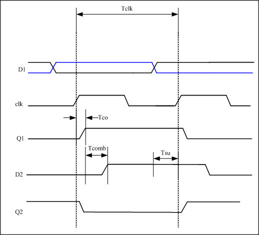
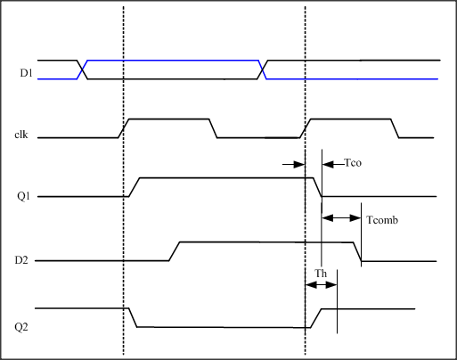

# VHDL-learning
VHDL FPGA学习

## 跨时钟域问题  第一弹

### 准备知识1：异步时钟与同步时钟
说到跨时钟域问题，也是FPGA设计中比较基础的问题之一。首先讨论异步时钟与同步时钟的概念。  

对于不算很严格的同步电路定义有：  
* 所有时钟的时钟来自同一个时钟源，比如有一个分频电路，产生了CLKA、CLKB、CLKC、CLKD，因为它们都是由300M时钟源分频而来，因此这个系统属于**同步电路**系统。  

* 当不是来自同一个时钟源时，只要CLOCK的周期有倍数关系并且相互之间的相位关系是固定的就可以算是同步电路，比如， 电路中用了10ns, 5ns, 2.5ns 三个时钟，这三个时钟不是由同一个时钟源分频来的，但是这三个时钟的周期有倍数关系并且相位关系固定：10ns是5ns的2倍，是2.5ns的两倍，之间是整数倍关系；相位关系是固定的，因此也算是**同步电路**。  
　　但是如果CLOCK之间没有倍数关系或者相互之间的相位关系不是固定的，比如电路中用5ns, 3ns 两个CLOCK，这两个时钟不是来自同一个时钟源，两者之间没有周期关系，因此是**异步电路**。  
  
  因此，在设计过程中我们就需要考虑这两种情况下的跨时钟域问题。为什么需要考虑跨时钟域问题呢？因为跨时钟域会导致各种危害，如：  
  * 数据丢失，无法采到预期中的信号； 
  * 亚稳态的产生。一旦寄存器进入亚稳态，其输出不能确定。且亚稳态的震荡时间如果超过一个时钟周期，会造成亚稳态串扰。如果电路中出现大面积的亚稳态现象，系统可能会崩溃。
  

## 准备知识2：建立时间与保持时间
  讨论跨时钟域问题，离不开建立时间Tsu和保持时间Thold这两个概念。
  

  * 建立时间（Tsu：set up time）　　
   是指在触发器的时钟信号上升沿到来以前，数据稳定不变的时间，如果建立时间不够，数据将不能在这个时钟上升沿被稳定的打入触发器，Tsu就是指这个最小的稳定时间。 

  * 保持时间（Th：hold time）　　
    是指在触发器的时钟信号上升沿到来以后，数据稳定不变的时间，如果保持时间不够，数据同样不能被稳定的打入触发器，Th就是指这个最小的保持时间。
    
    满足建立和保持时间要求，电路状态改变就是正确的，电路功能就不会发生错误；如果不满足，电容就没有足够的时间充放电，造输出点的电平可能既非0也非1，造成“亚稳态“输出。那么，如何才能让自己的电路设计满足Tsu和Th的要求呢？下面用常见的电路模型介绍对Tsh和Th的约束条件。     
    
    首先介绍其他的常用时间概念：

  * 输出响应时间（Tco）　
    触发器输出的响应时间，也就是触发器的输出在clk时钟上升沿到来之后多长的时间内发生变化，也即触发器的输出延时。   
    
  * 组合逻辑延迟(Tcomb)
    触发器的输出经过组合逻辑所需要的时间。我的理解是，在VHDL语言中所写的if-else，switch等选择逻辑如果层次过多，会导致Tcomb增大。因此要选择尽可能简洁的描述方式去优化自己的代码。 
   
  * 时钟偏差(Time skew)
    由于时钟到每个寄存器的路径延迟不一样，造成信号到达寄存器的输入端 clock pin 的时间也不一样，我们把时钟信号到达不同寄存器的时间偏差称为skew。其实time skew在FPGA设计中是可以忽略的，由于在FPGA 设计中一般是采用统一的系统时钟，也就是利用从全局时钟管脚输入的时钟，这样在内部时钟的延时完全可以忽略不计。
    
    FPGA设计中不外乎寄存器加组合逻辑，因此以下面的模型分析时序约束：
    
    

    
    图中存在两个DFF，D1、Q1为DFF1的输入输出，D2、Q2为DFF2的输入输出，Tco为第一级DFF的输出延时，Tsu为第二级DFF的建立时间，Th为第二级DFF的保持时间。它们应该满足什么关系呢？   
* 建立时间需要满足的条件
    
    

　　在第一个时钟上升沿，前边的触发器采集D1信号，将高电平打入触发器，经过Tco的触发器输出延时到达组合逻辑电路。又经过组合逻辑电路的延时Tcomb（我们假定组合逻辑电路此时没有改变信号的高低，可以把它假定为一个缓冲器）送到了D2接口上。在第二个时钟上升沿到来之前，D2数据线上的信号要满足稳定时间>触发器的建立时间Tsu。
   
 Tclk - Tco - Tcomb > Tsu 
  
   
　　考虑最坏的情况：触发器的输出延时最大，组合逻辑电路的延时也最大，可得    
    
 Tclk - Tco_max - Tcomb_max > Tsu 
  
    
 * 保持时间需要满足的条件  
    
    
  
    
    
　　相对于建立时间，保持时间比较难理解，其实质是前一级DFF的输出不能太快在当前沿到达DFF2。为防止DFF1采到的新数据太快到达DFF2而“冲掉”原来的正确数据，数据必须要在一定时间之后才允许到达，所以保持时间分析，分析的是DFF1和DFF2的同一个时钟沿。  
    
　　接着之前的时序图继续，在第二个时钟上升沿前边触发器采集到D1上的低电平，经过Tco的延时在Q1上得到表达。这个低电平在经过组合电路延时Tcomb到达D2。现在的问题是经过这么Tco+Tcomb的延时，D2上原本的高电平在**第二个时钟上升沿到来之后的稳定时间 > 第二个触发器的保持时间**。满足了这个条件，后边的触发器才能稳定的接收到最初由D1传过来的高电平。   
    
 Tco + Tcomb > Th 
  
 　　考虑到最坏的情况：触发器的输出延时最小，组合逻辑电路的延时也最小。
   
 Tco_min + Tcomb_min > Th 
  
   
 * 我们可以得到中间组合逻辑电路的输出延时范围为

    
 (Tclk - Tco_max -  Tsu) > Tcomb > (Th - Tco_min) 
  
    
　　因此，在一个已经给出时钟频率的电路中，由于电子元件的建立时间、保持时间都是不变的，我们要满足时序约束，必须使组合逻辑电路延迟满足上面的公式。

　　同时，这个公式也可以反向考虑，如果我们想推断自己的系统可以运行的最大时钟频率Fmax，我们可以通过前半部分公式来倒推。  
　　首先让我们先来看看Fmax 是如何计算出来的。时钟周期 Tclk = Tco + Tcomb + Troute + Tsu, 则时钟频率 Fmax = 1/Tclk。其中 Troute 为FPGA的布线延时。  
　　在影响 Fmax 的四个参数中，由于针对某一个器件 Tsu 和 Tco 是固定的，因此我们在设计中需要考虑的参数只有两个 Tcomb 和 Troute。通过良好的设计以及一些如 Pipeline 的技巧，我们可以把Tcomb 和Troute 控制在一定的范围内。达到我们所要求的Fmax。  
　　经验表明一个良好的设计，通常可以将组合逻辑的层次控制在 4 层以内，即 (Lut Levels <= 4) 。而 Lut Levels (组合逻辑的层次) 将直接影响 Tcomb 和Troute 的大小。组合逻辑的层次多，则 Tcomb 和 Troute 的延时就大，反之，组合逻辑的层次少，则 Tcomb 和 Troute 的延时就小。
  
 * 加入时钟延迟的模型
 
   
  
    
    
    若存在时钟延迟，可以看出 Tskew 使建立时间的条件变松，而保持时间的条件变紧。总之，**建立时间和保持时间的条件是对立的**。  
    此时的公式变为：  
    
 Tskew + Tclk - Tco_max - Tcomb_max > Tsu 
 
    
 Tco_min + Tcomb_min - Tskew > Th 
  
    
 (Tskew + Tclk - Tco_max -  Tsu) > Tcomb > (Th - Tco_min + Tskew) 
  
    
    
    
    
    
    
    
