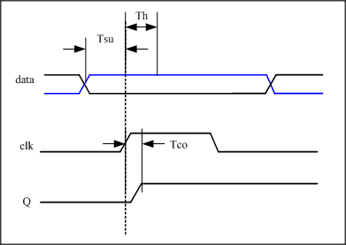
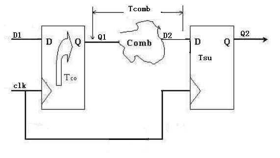

# VHDL-learning
VHDL FPGA学习

## 跨时钟域问题  

### 准备知识1：异步时钟与同步时钟
说到跨时钟域问题，也是FPGA设计中比较基础的问题之一。首先讨论异步时钟与同步时钟的概念。  

对于不算很严格的同步电路定义有：  
* 所有时钟的时钟来自同一个时钟源，比如有一个分频电路，产生了CLKA、CLKB、CLKC、CLKD，因为它们都是由300M时钟源分频而来，因此这个系统属于**同步电路**系统。  

* 当不是来自同一个时钟源时，只要CLOCK的周期有倍数关系并且相互之间的相位关系是固定的就可以算是同步电路，比如， 电路中用了10ns, 5ns, 2.5ns 三个时钟，这三个时钟不是由同一个时钟源分频来的，但是这三个时钟的周期有倍数关系并且相位关系固定：10ns是5ns的2倍，是2.5ns的两倍，之间是整数倍关系；相位关系是固定的，因此也算是**同步电路**。  
　　但是如果CLOCK之间没有倍数关系或者相互之间的相位关系不是固定的，比如电路中用5ns, 3ns 两个CLOCK，这两个时钟不是来自同一个时钟源，两者之间没有周期关系，因此是**异步电路**。  
  
  因此，在设计过程中我们就需要考虑这两种情况下的跨时钟域问题。为什么需要考虑跨时钟域问题呢？因为跨时钟域会导致各种危害，如：  
  * 数据丢失，无法采到预期中的信号； 
  * 亚稳态的产生。一旦寄存器进入亚稳态，其输出不能确定。且亚稳态的震荡时间如果超过一个时钟周期，会造成亚稳态串扰。如果电路中出现大面积的亚稳态现象，系统可能会崩溃。
  

## 准备知识2：建立时间与保持时间
  讨论跨时钟域问题，离不开建立时间Tsu和保持时间Thold这两个概念。
  

  * 建立时间（Tsu：set up time）　　
   是指在触发器的时钟信号上升沿到来以前，数据稳定不变的时间，如果建立时间不够，数据将不能在这个时钟上升沿被稳定的打入触发器，Tsu就是指这个最小的稳定时间。 

  * 保持时间（Th：hold time）　　
    是指在触发器的时钟信号上升沿到来以后，数据稳定不变的时间，如果保持时间不够，数据同样不能被稳定的打入触发器，Th就是指这个最小的保持时间。
    
    满足建立和保持时间要求，电路状态改变就是正确的，电路功能就不会发生错误；如果不满足，电容就没有足够的时间充放电，造输出点的电平可能既非0也非1，造成“亚稳态“输出。那么，如何才能让自己的电路设计满足Tsu和Th的要求呢？下面用常见的电路模型介绍对Tsh和Th的约束条件。     
    
    首先介绍其他的常用时间概念：

  * 输出响应时间（Tco）　
    触发器输出的响应时间，也就是触发器的输出在clk时钟上升沿到来之后多长的时间内发生变化，也即触发器的输出延时。   
    
  * 组合逻辑延迟(Tcomb)
    触发器的输出经过组合逻辑所需要的时间。我的理解是，在VHDL语言中所写的if-else，switch等选择逻辑如果层次过多，会导致Tcomb增大。因此要选择尽可能简洁的描述方式去优化自己的代码。 
   
  * 时钟偏差(Time skew)
    由于时钟到每个寄存器的路径延迟不一样，造成信号到达寄存器的输入端 clock pin 的时间也不一样，我们把时钟信号到达不同寄存器的时间偏差称为skew。但是在FPGA中，由于在布局布线过程中已经考虑了时钟偏差，time skew的存在一般可以忽略。
    
    FPGA设计中不外乎寄存器加组合逻辑，因此以下面的模型分析时序约束：
    

    
    图中存在两个DFF，D1、Q1为DFF1的输入输出，D2、Q2为DFF2的输入输出，Tco

　　

　　
　　

    
    

